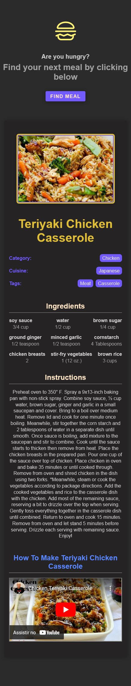
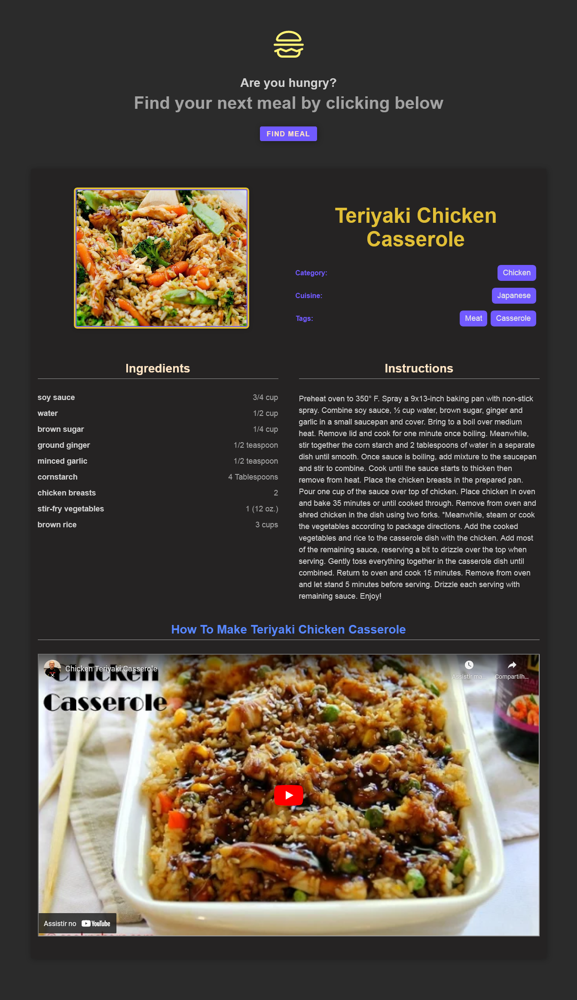

# Random meal generator

## 📷 Screenshots

  
  &nbsp;&nbsp;&nbsp;
  

## 💻 Projeto
Aplicação que busca uma refeição aleatória da API.

## 🧪 Tecnologias utilizadas
- [React](https://reactjs.org)
- [React Query](https://tanstack.com/query/v4/)
- [TypeScript](https://www.typescriptlang.org/)
- [SASS](https://sass-lang.com/)
